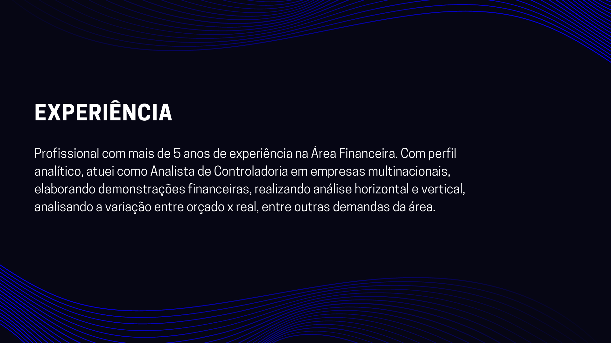
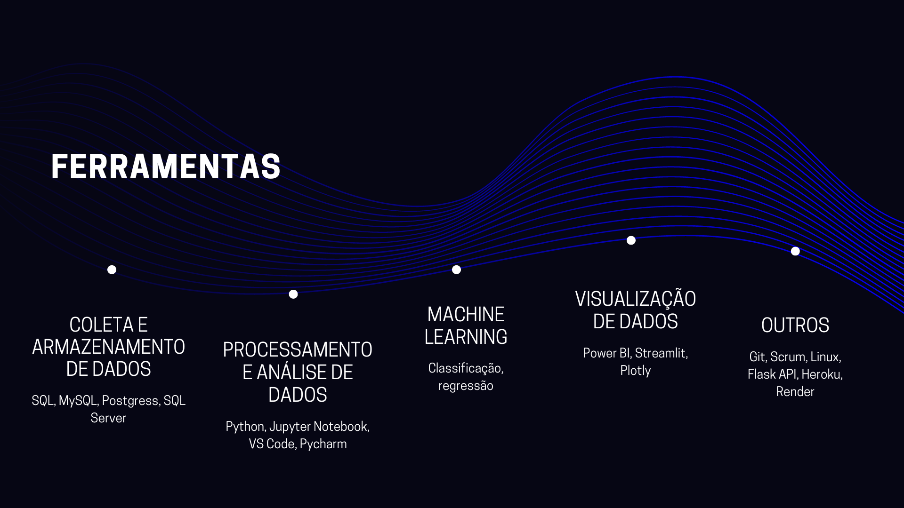

# Projetos
## [Previsão de vendas com seis semanas de antecedência usando Algoritmos de Regressão](https://github.com/wesleysantosds/rossmann_sales_prediction).

Construção de um algoritmo de Machine Learning para prever vendas com 6 semanas de antecedência em uma rede de farmácias na Europa. O algoritmo de Regressão treinado possui 90% de MAPE e o resultado estimado da solução é de R$ 5 milhões de faturamento incremental no mês.

## [Desenvolvimento de um Painel Gerencial para Negócio com o Streamlit](https://github.com/wesleysantosds/curry_company).

Nesse projeto, os conceitos de Programação em Python, manipulação de dados, pensamento estratégico e lógica de negócio, junto com ferramentas de desenvolvimento web como o Streamlit e Github, foram usados para desenvolver um painel gerencial com as principais métricas de uma empresa marketplace de delivery de comida na Índia.

